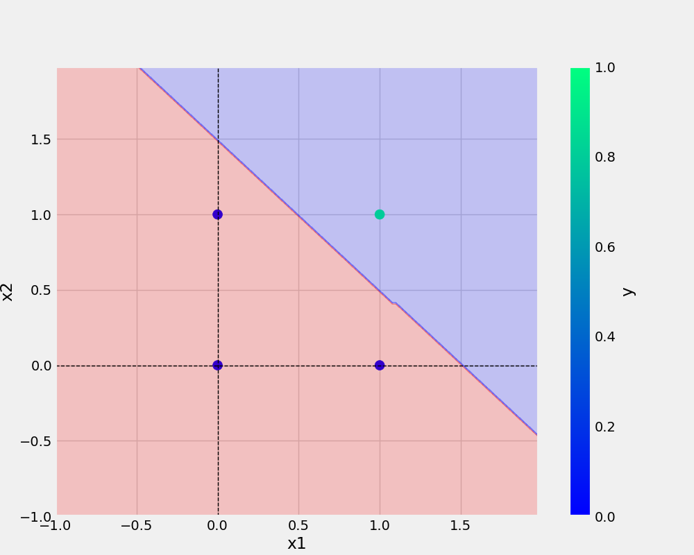

# oneNeuron
oneNeuron | perceptron

# commands used -
 

 git add . && git commit -m "docstring updated" && git push origin main

python
from utils.all_utils import prepare_data

'''
## Add URL -
[Git handbook] (https://guides.github.com/introduction/git-handbook/)

[README] (https://readme.so/editor)

<a href="https://www.google.com">visit google! </a>

## Add image - 
![sample Image] (plots/and.png)

